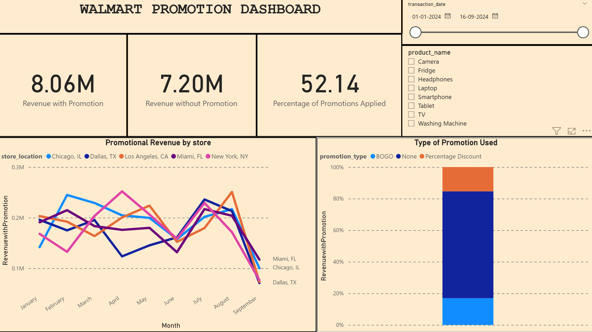
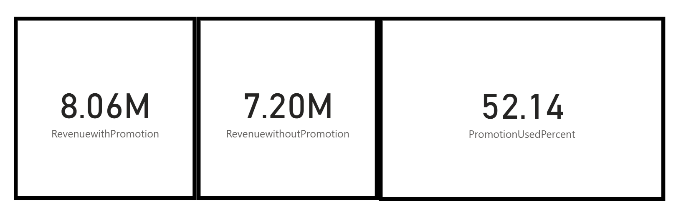
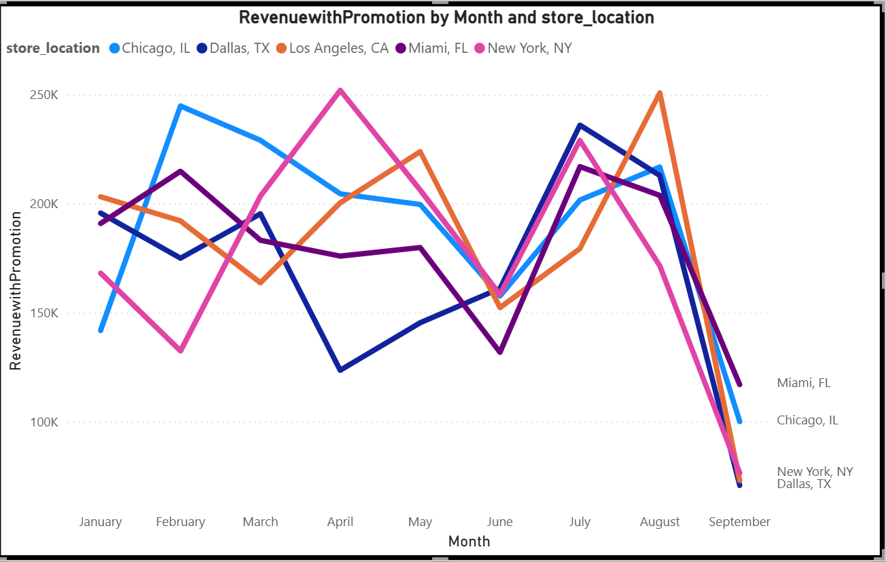
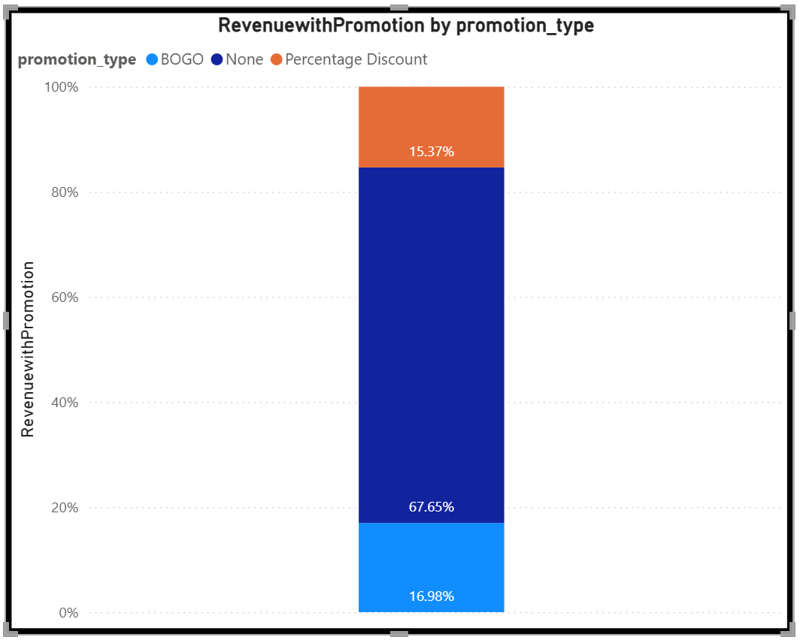
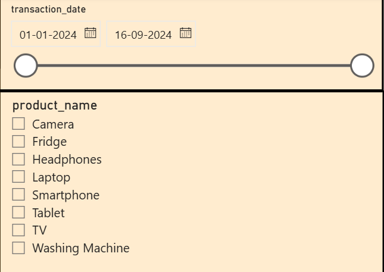

# Walmart-Promotion-Dashboard
Walmart’s promotion effectiveness to optimize campaign strategy and store performance.

## Project Overview

The project focuses on analyzing Walmart's promotional campaign performance using a dataset of transactions, products, and store-level data. The goal is to assess how promotions affect revenue and identify which strategies, locations, and product types generate the most value.

---

## Objectives

- Evaluate revenue with and without promotions.  
- Identify the most effective promotion types.  
- Compare store performance by promotional revenue.  
- Visualize trends using Power BI.  
- Provide actionable business insights.

---

## Dataset Overview

- **Transactions** from Jan–Sept 2024  
- Includes product, store, customer, promotion, pricing, and demand data  
- Key fields: `product_name`, `promotion_applied`, `promotion_type`, `store_location`, `unit_price`, `quantity_sold`, `transaction_date`

---

## Tools & Tech Stack

- **Power BI** for dashboarding  
- **Power Query** for cleaning & transformation  
- **DAX** for custom measures  
- **CSV** as data source

---

## Stage 1: KPI Summary Section

This section highlights high-level performance of Walmart promotions.

**Screenshot:**  

**Highlights:**  
- **Revenue with Promotion:** ₹8.06M  
- **Revenue without Promotion:** ₹7.20M  
- **Promotion Usage Rate:** 52.14%

Promotions are generating more revenue, but margin is tight ,optimization is needed.

---

## Stage 2: Monthly Promotional Revenue by Store

This line chart compares monthly promotional revenue across different locations.

**Screenshot:**  

**Insights:**  
- **Miami and Chicago** are consistently top performers.  
- Seasonal spikes in **February**, **July**, and **August**.  
- Dallas shows volatility — possible demand or supply chain issues.

---

## Stage 3: Promotion Type Breakdown

This stacked bar chart shows how each promotion type contributes to total revenue.

**Screenshot:**  

**Insights:**  
- **Percentage Discount** is the most used and effective type.  
- **BOGO** has moderate adoption.  
- **No promotion** still drives nearly half the revenue , indicating strong baseline demand.

---

## Filters (Slicers)

**Screenshot:**  

**Features:**  
- Filter by:  
  - Date range  
  - Specific product (e.g., TV, Smartphone, Fridge)  
- Allows drill-down into product-level promotional performance

---

## Key Insights Summary

| Category         | Insight                              | Reasoning                                  |
|------------------|------------------------------------|--------------------------------------------|
| Promotion Impact | Revenue with promotions is ₹8.06M vs ₹7.20M without | Indicates effectiveness, but room for margin growth |
| Usage Rate       | 52.14% of sales use promotions     | May suggest overuse, consider controlled discounting |
| Store Trends     | Miami & Chicago lead in promo revenue | Possible better in-store campaigns or local buying behavior |
| Promotion Type   | Percentage Discount > BOGO          | Simpler, more attractive for higher-value products |
| Time Patterns    | Spikes in Feb, Jul, Aug             | Aligned with sales seasons or regional holidays |

---

## Probable Reasons Behind Trends

- Customers prefer **upfront discounts** (vs. bundled offers).  
- Certain stores benefit from **demographics, traffic, or execution quality**.  
- **Over-reliance on discounts** may impact long-term profit margins.  
- **Seasonality** and **timing** are key to promotional success.

---

## Files in Repository

- `Walmart_Orders.csv` – Cleaned transaction data  
- `README.md` – Full project documentation  
- `Walmart_Promotion_Dashboard.pbix` – Power BI dashboard (optional)

---

## Conclusion

This dashboard empowers Walmart’s marketing team to:  
- Understand what types of promotions truly work  
- Allocate promotional budgets smartly  
- Increase ROI by eliminating low-performing campaigns

---

## Visitor Count

Thank you for visiting this project!  

